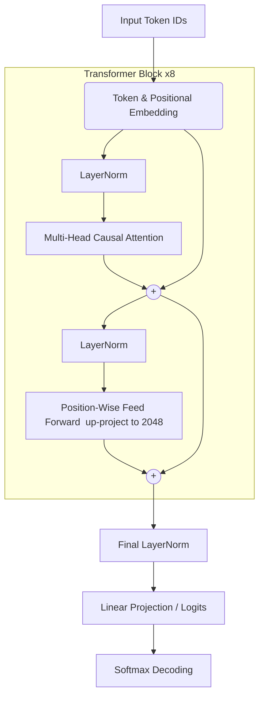

# Multilingual-Text-LLM: Decoder-Only Transformer

A professional, ground-up implementation of a Decoder-only Transformer architecture designed for multilingual autoregressive text generation, explicitly optimized for English and Hindi (Devanagari/Latin) contexts. This repository details the complete end-to-end pipeline, moving from custom Byte Pair Encoding (BPE) tokenization and data curation to distributed-ready, schedules-integrated training.

---

## 🚀 Architectural Overview

This model implements an **Autoregressive Large Language Model (LLM)** patterned after the core architecture introduced in *Attention Is All You Need* (Vaswani et al.) and refined in GPT-style architectures (using Pre-LayerNorm configurations). It is designed to model the probability distribution over a sequence of tokens natively across language barriers.

### Core Technical Specifications
- **Architecture**: Decoder-only Causal Transformer
- **Total Parameters**: ~21.7 Million
- **Vocabulary Size**: 16,000 (Custom SentencePiece BPE)
- **Embedding Dimension ($d_{model}$)**: 512
- **Attention Heads ($h$)**: 8 (with $d_k = d_v = 64$)
- **Transformer Layers**: 8
- **Context Window**: 128 Tokens
- **Non-Linear Activation**: GELU (Gaussian Error Linear Unit)
- **Optimization**: AdamW with Cosine Annealing Learning Rate Schedule

---

## 🧠 System Architecture & Data Flow



### 1. Tokenization & High-Dimensional Projections
The sequence ingestion relies on a custom-trained **Byte Pair Encoding (BPE)** model via the SentencePiece library. BPE iteratively merges the most frequent adjacent byte/character pairs, creating a subword vocabulary that successfully manages Out-Of-Vocabulary (OOV) tokens while keeping the embedding matrix computationally lean. 
- **Vocabulary Mapping**: Tokens $x_i \in \{0, 1, ..., 15999\}$ are mapped via an $\mathbb{R}^{16000 \times 512}$ embedding matrix.
- **Positional Encoding**: Since the Transformer contains no recurrent or convolutional structure, sequence order is injected via a learned positional embedding matrix $\mathbb{R}^{128 \times 512}$ mapped iteratively over the given sequence positions.

### 2. Multi-Head Causal Self-Attention
The core spatial/contextual reasoning occurs within the Multi-Head Attention mechanisms. The model slices the 512-dimensional embedding into 8 separate attention heads ($d_k = 64$), computing the attention operation in parallel to capture distinct semantic and syntactic contexts natively.

For each head, the input is linearly projected into Queries ($Q$), Keys ($K$), and Values ($V$):
$$ \text{Attention}(Q, K, V) = \text{softmax}\left(\frac{QK^T}{\sqrt{d_k}} + M\right)V $$

Where $M$ is the strictly lower-triangular **causal mask**. The mask acts as a $- \infty$ penalization matrix applied to all future tokens, forcing the model to operate strictly autoregressively and inherently preventing data leakage during training parallelization.

### 3. Pre-LayerNorm Residual Stream
The network utilizes a **Pre-LayerNorm** (Pre-LN) pathway instead of the original Post-LN formulation. Pre-LN ensures unhampered gradient flow through deep networks directly to the early embedding layers via the residual path without saturation blockages.
- The **Position-Wise Feed Forward Network** (FFN) applies a dense expansion factor of 4x (from 512 to 2048 parameters) using a GELU activation, which smoothens zero-crossing nonlinearities compared to standard ReLU.

---

## ⚙️ Mathematical Parameter Breakdown

To understand the computational footprint, the parameter distribution is roughly modeled as follows:
- **Embedding Spaces**: $16,000 \times 512$ (Tokens) $+ 128 \times 512$ (Positions) $\approx 8.25M$
- **Single Transformer Block**: 
  - $W_q, W_k, W_v, W_o$ matrices: $4 \times (512 \times 512) \approx 1M$
  - FFN Matrices: $(512 \times 2048) + (2048 \times 512) \approx 2M$
  - Total per block $\approx 3M$
- **Total across 8 Blocks**: $8 \times 3M \approx 24M$ (*Note: minor variations exist due to biases and norms*)
- **Output Head**: Tied or Independent projection of size $512 \times 16,000$ $\approx 8.1M$

---

## 🔬 Training Dynamics & Optimization

The model employs high-grade optimizations standard in massive-scale pre-training.

1. **Loss Function Optimization**
   The architecture models training as next-token prediction, penalizing divergences via **Cross-Entropy Loss**:
   $$ L = -\sum_{c=1}^{V} y_c \log(\hat{y}_c) $$
   *(Computed densely over flattened batch-sequences.)*

2. **Cosine Annealing with Warmup**
   To avoid gradient detonation during random-initialization starting conditions, the learning rate undergoes a linear **warmup phase** (e.g., 200 iterations). Post-warmup, the learning rate gracefully steps down according to a Cosine Annealing envelope, converging safely to a baseline $10\%$ fraction of the max learning rate ($LR_{min} = 2e-5$) to polish final model representations.

3. **In-Memory Windowing Optimization**
   Training is heavily accelerated by pre-tokenizing the corpus into a flat buffer (`tokens.bin`) mapping as `int32` constructs, dynamically instantiating non-overlapping batched memory slices in VRAM to actively avoid sequential and categorical data entanglement.

---

## 🎲 Inference & Decoding Pipeline

Text generation natively operates via stochastic sampling with temperature distribution adjustments:
$$ p_i = \frac{\exp(z_i / T)}{\sum \exp(z_j / T)} $$
Where $T$ is the context temperature.

Additionally, we deploy **Top-K Truncation** (default $K=40$). Rather than computing the raw multinomial distributions across all $16,000$ classes simultaneously—which opens exposure paths for extremely unlikely out-of-context tokens that cause feedback hallucination regressions—the Top-K system clips all sequence logits beneath the 40th most likely probability to $-\infty$, isolating output boundaries purely within confident syntactical predictions.

---

## 🛠️ Pipeline & Execution Guide

The workflow relies strictly on standard PyTorch without distributed abstractions for ease of modular testing:

```bash
# 1. Digest the raw text inputs and generate BPE token graphs
python3 tokenize_data.py

# 2. Begin end-to-end autoregressive representation training
python3 train.py

# 3. Instantiate model weights and inference novel sentences (Hinglish/English)
python3 generate.py

# 4. Evaluate exact-token accuracy and Sequence Perplexity formulations
python3 evaluate.py
```
